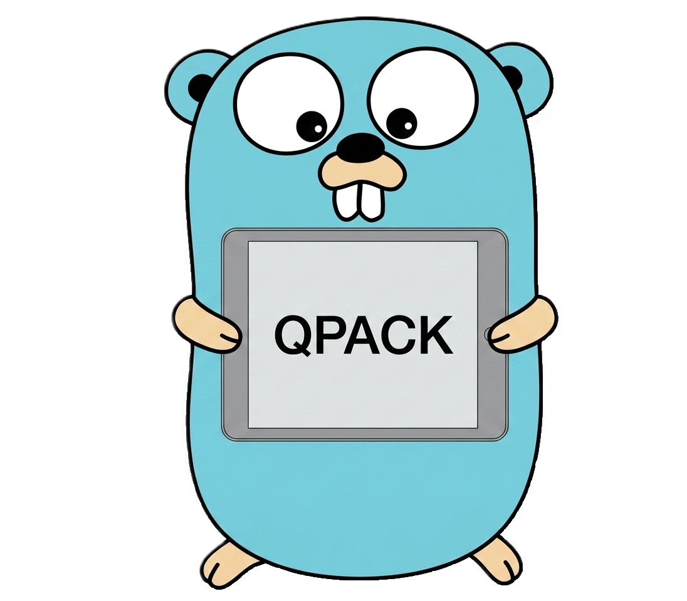

<div align="center" style="margin-bottom: 15px;">
  
</div>

# QPACK HTTP3


[](https://github.com/NguyenHien-8/qpack-http3/blob/master/LICENSE)
[](https://codecov.io/gh/NguyenHien-8/qpack-http3)
[](https://codspeed.io/NguyenHien-8/qpack-http3?utm_source=badge)

This is a minimal QPACK ([RFC 9204](https://datatracker.ietf.org/doc/html/rfc9204)) implementation in Go. It reuses the Huffman encoder / decoder code from the [HPACK implementation in the Go standard library](https://github.com/golang/net/tree/master/http2/hpack).

It is fully interoperable with other QPACK implementations (both encoders and decoders). It supports both static and dynamic tables with character strings (including Huffman encoding).

## Release Policy

The QPACK HTTP3 always aims to update to the latest versions.

## Contributing

We are always happy to welcome new contributors. If you have any questions, please feel free to reach out by opening an issue or leaving a comment [issues](https://github.com/NguyenHien-8/qpack-http3/issues).

## Running the Interop Tests
### Run On Window

* Install the [QPACK interop files](https://github.com/NguyenHien-8/qpack-interop-format/) by running:
```bash
git submodule update --init --recursive
```

* If the submodule cannot be updated. Give it a try:
```bash
git submodule add https://github.com/NguyenHien-8/qpack-interop-format.git interop/qifs
```

* Then run the tests:
```bash
go test -v ./interop
```

### Case: If QIFS can be installed
* Check which submodules are present in .gitmodules:
```bash
git submodule status
```

* Unsubscribe from the submodule:
```bash
git submodule deinit -f interop/qifs  2>$null
git rm --cached interop/qifs          2>$null
```

* Delete the hidden `.git/modules` directory of the old submodule:
```bash
Remove-Item interop\qifs -Force -Recurse
```

* Delete the `interop/qifs` directory from the working tree (if it still exists):
```bash
Remove-Item -Recurse -Force interop/qifs
```

* And run the submodule again:
```bash
git submodule add https://github.com/NguyenHien-8/qpack-interop-format.git interop/qifs
```

### Other Commands
```bash
git submodule status
```

```bash
git ls-files interop
```

* Init submodule:
```bash
git submodule init
```